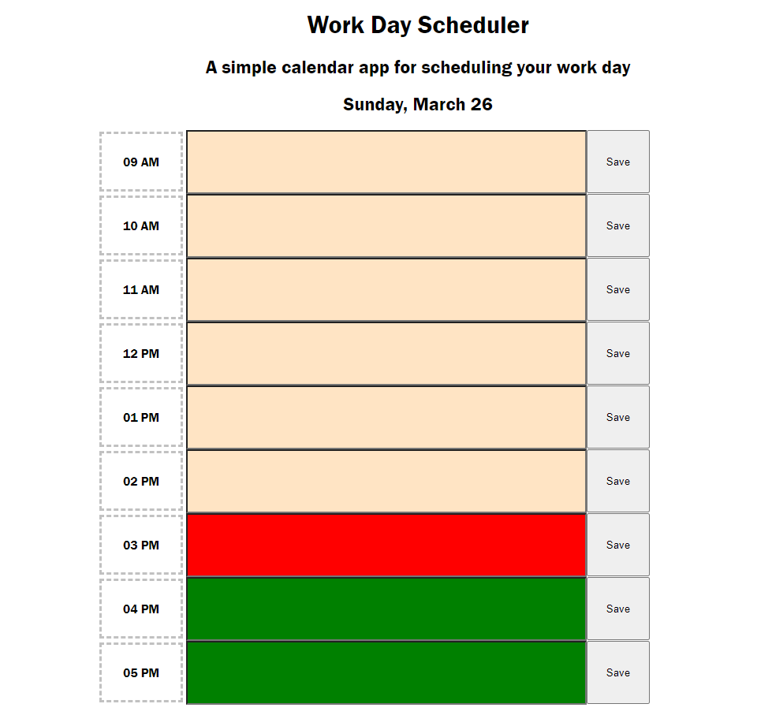

# Event-Planner-Challenge

## User Story

### AS AN employee with a busy schedule.
<li>I WANT to add important events to a daily planner
<li>SO THAT I can manage my time effectively

## Acceptance Criteria.
### GIVEN I am using a daily planner to create a schedule.

<li>WHEN I open the planner
<li>THEN the current day is displayed at the top of the calendar
<li>WHEN I scroll down
<li>THEN I am presented with time blocks for standard business hours
<li>WHEN I view the time blocks for that day
<li>THEN each time block is color-coded to indicate whether it is in the past, present, or future
<li>WHEN I click into a time block
<li>THEN I can enter an event
<li>WHEN I click the save button for that time block
<li>THEN the text for that event is saved in local storage
<li>WHEN I refresh the page
<li>THEN the saved events persist

## Description

In this project we to use a combination of our js skills to create an event planner that saves the data to local storage, this way if someone closes the session or refreshes the page, the data is still populated and saved.

## Usage

To open the page, simply click on the following link: "https://strugglerxiv.github.io/Event-Planner-Challenge/"

This a screenshot showcasing the live deployed webpage on github:

## Credits

-The amazing teaching staff at the UCF coding bootcamp.

## License

MIT License
